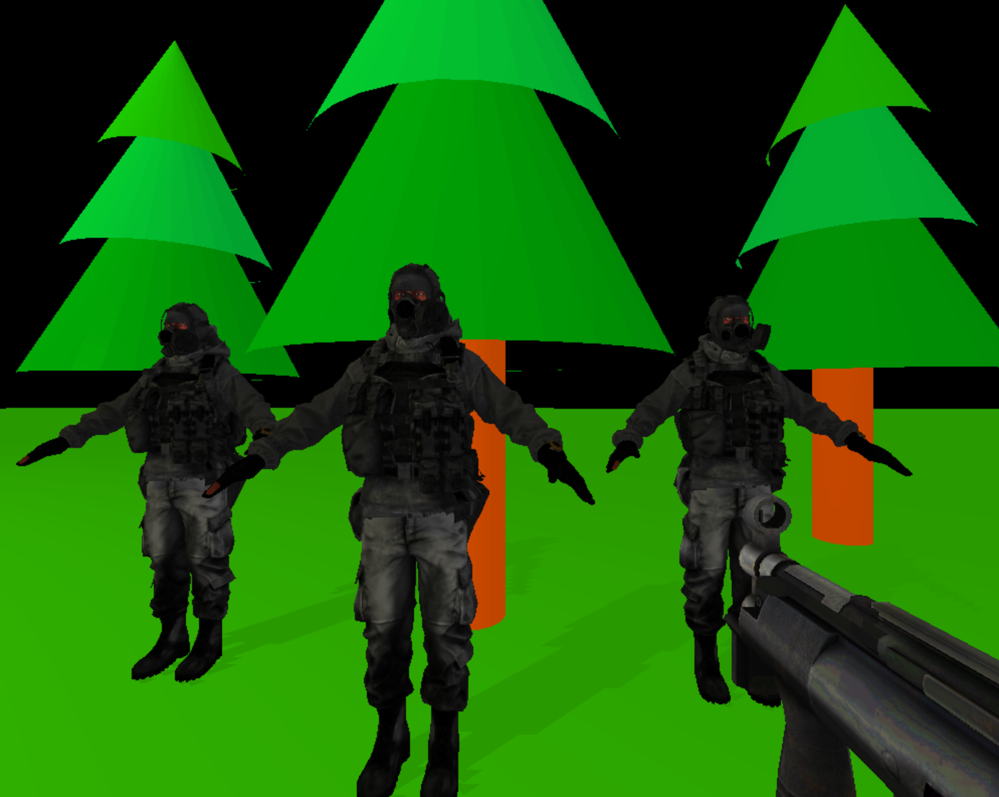

<h1 align="center">3D射击游戏</h1>

<sm>计算机图形学 Project 3 - 真实感景物</sm>

WASD移动，Space跳跃，鼠标射击

## 说明
本Project用到了three.js，涵盖模型加载、渲染、灯光、阴影、交互、视角更新等内容。

# 参考资料
* https://threejs.org/
* https://clara.io/library